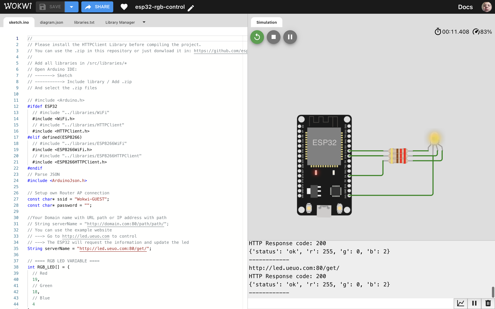
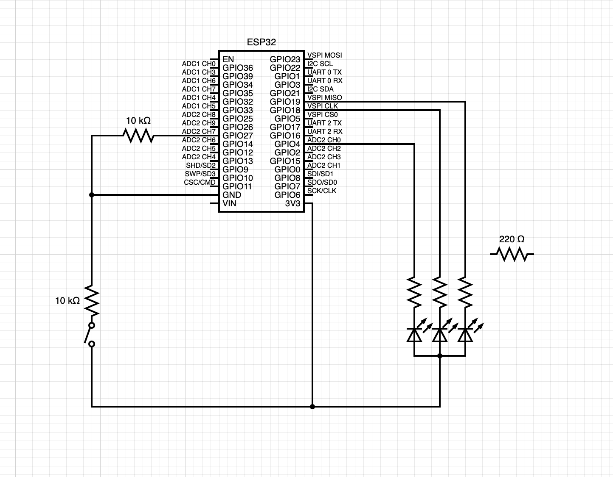

# ESP32 RGB Led Controller


this project allow you to control your ESP32 RGB Led from a web server. (Local or External)

## Wokwi

Access to the Wokwi simulation: [https://wokwi.com/projects/363603047301474305](https://wokwi.com/projects/363603047301474305)

Start the project and go to [http://led.ueuo.com](http://led.ueuo.com) to control the RGB Led.



## Index

* [Installation](#installation)
* [How to use](#how-to-use)
    - [Local Server](#local-server)
    - [External Server](#external-server)
* [Hardware](#hardware)
* [Flashing](#flashing)
  - ESP32
  - ESP8266
* [License](#license)

<hr>

## Installation

1. Download the code from this repository `git clone http://github.com/ZhengLinLei/esp32-rgb-control.git`
2. Open your Arduino IDE
3. Install all the libraries from the `/src/libraries` folder (In `Sketch` > `Include Library` > `Add .ZIP Library...`)
4. Open the code in the Arduino IDE (localServer or externalServer)
5. Upload the code to the ESP32 or ESP8266

<hr>

## How to use

### Local Server

If you want to use the RGB in your local network, just connect your `ESP32` into power and access to the IP address of your `ESP32` in your browser. (You can see the IP address in the Serial Monitor).
Once you are in the web server, you can control the RGB Led.


**Note:** If you want to use the RGB Led in your local network, you need to be connected to the same network.


All the server structure is:
* `/` (Home page where you can control the RGB Led)
* `/r/?range={0-255}` (Change the red value) {API}
* `/g/?range={0-255}` (Change the green value) {API}
* `/b/?range={0-255}` (Change the blue value) {API}

The code to fetch the API is in the `index.html` file inside `src/localServer` folder.
```javascript
// Get the range inputs
const red = document.getElementById('red');
const green = document.getElementById('green');
const blue = document.getElementById('blue');

let arr = [red, green, blue];

let arr_name = ['r', 'g', 'b'];

let ip = '192.168.0.104';

// When any range move send GET request to IP
function updateBG() {
    document.body.style.backgroundColor = `rgb(${red.value}, ${green.value}, ${blue.value})`;
}

for (let i = 0; i < arr.length; i++) {
    arr[i].addEventListener('input', () => {
        fetch(`http://${ip}/${arr_name[i]}/?range=${arr[i].value}`);
        updateBG();
    });
}


// Set color
updateBG();
```

### External Server

If you want to use the RGB Led in your external network, you need to have a server with a static IP address. You can use the server that we have created for this project:[http://led.ueuo.com] (http://led.ueuo.com).

All the source web server code is inside `/server/` folder:
* `/index.php` (Home page where you can control the RGB Led)
* `/get/index.php` (Get the RGB values from database) {API}
* `/set/index.php?color={r, g, b}&range={0-255}` (Set the RGB values to database) {API}
* `/install/index.php` (Install the database)

The ESP32 will use the `/get/index.php` to get the RGB values and update the led in `timerDelay` interval.
```cpp
/* =================
  The server return the data as: {"status":"ok", "r": 0, "g": 0, "b": 0}
=================== */

// The following variables are unsigned longs because the time, measured in
// milliseconds, will quickly become a bigger number than can be stored in an int.
unsigned long lastTime = 0;
// Timer set to 10 minutes (600000)
//unsigned long timerDelay = 600000;
// Set timer to 5 seconds (5000)
// unsigned long timerDelay = 5000;
unsigned long timerDelay = 100; // 100ms
```


Both servers need to configure your router WiFi network SSID and password in their files before flashing the code to the ESP32 or ESP8266.
```cpp
// Setup own Router AP connection
const char* ssid = "********";
const char* password = "********";
```

<hr>

## Hardware

You can use any ESP32 or ESP8266 board. In this project we have used the following boards:
* ESP32 DEVKIT V1
* ESP8266 NodeMCU V3

The RGB Led is connected to the following pins:
* Red: GPIO 19
* Green: GPIO 18
* Blue: GPIO 4



<hr>


## Flashing

`Pending to update` The code is ready to be used in the ESP32 and ESP8266. You only need to change the board in the Arduino IDE and flash the code. But if you prefer use `idf.py` to flash the code, you have to wait until we update the code to be compatible with `idf.py` inside `build` folder.


<hr>

This project is licensed under the terms of the Apache2.0 license.
```
                                Apache License
                           Version 2.0, January 2004
                        http://www.apache.org/licenses/

```

### Love this repo? Give us a star ⭐

<a href="./">
  
</a>
